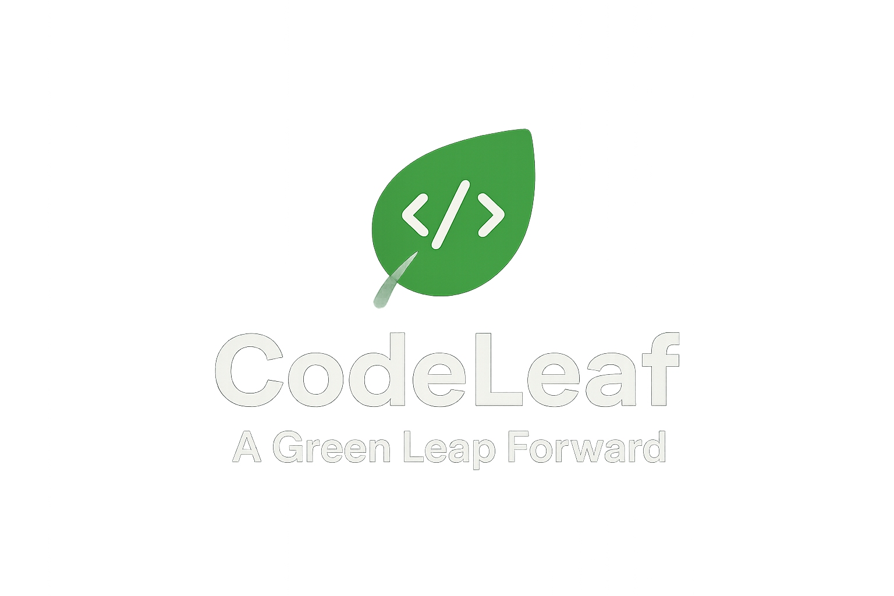

  

<i>"A Green Leap Forward — Smart, Simple, Student-Friendly"</i>

📌 About
CodeLeaf AI is a cost-effective AI assistant built by students, for students. It's designed to help developers write more efficient and sustainable code by providing eco-friendly coding insights and a powerful AI code assistant.

This is the MVP (Phase 1) version, focused on core functionalities that are lightweight and run with free and open-source tools.

✨ Features (Phase 1 MVP)
✅ Eco-Friendly Coding Insights using CodeCarbon to track estimated CO₂ emissions.
✅ AI Code Assistant to generate snippets and provide explanations.
✅ Math & General QnA for a broad range of queries.
✅ Streamlit Frontend for a clean, interactive user interface.
✅ Hugging Face API for AI model power (free tier).

🛠️ Tech Stack
Frontend: Streamlit  

Backend: Python  

AI Models: Hugging Face Free Inference API  

Version Control: Git + GitHub  

🚀 Quick Start (Step by Step)
Step 1 Clone the Repository
git clone [https://github.com/](https://github.com/)<your-username>/codeleaf-ai.git
cd codeleaf-ai

2 Create Virtual Environment
python -m venv venv
source venv/bin/activate   # (Linux/Mac)
venv\Scripts\activate      # (Windows PowerShell)

3. Install Dependencies
pip install -r requirements.txt

4. Get Hugging Face Token
Create free account → Hugging Face

Go to → Access Tokens

Create a token with Read permissions.

Copy it (looks like hf_xxxxxxxxxxx).

5. Add Environment Variables
Create a .env file in the root:

HF_TOKEN=hf_xxxxxxxxxxxxxxxxxxx

⚠️ Don’t push .env to GitHub (already in .gitignore).

6. Run Streamlit App
streamlit run app.py

🚀 Roadmap
Phase 1 – MVP (Goal: launch quickly with core AI + eco features)

Integrate CodeCarbon for CO₂ tracking.

Use Hugging Face free models for basic code explanation and generation.

Display results in a simple dashboard.

Phase 2 – Beta Release (Goal: improve usefulness and attract users)

Add multi-language support (Python + JS).

Integrate LlamaIndex / Haystack for code Q&A.

Use Electricity Maps API for real-time carbon intensity.

Implement “Green Badges” for gamification.

Phase 3 – Full Release (Goal: professional, scalable product)

Add an AI Pair Programmer feature.

Include enterprise features like team dashboards.

Build a community and marketplace.

Launch a companion mobile app.

🤝 Contributing
Since this is a student project, any feedback, ideas, or contributions are welcome. Feel free to fork and open PRs.